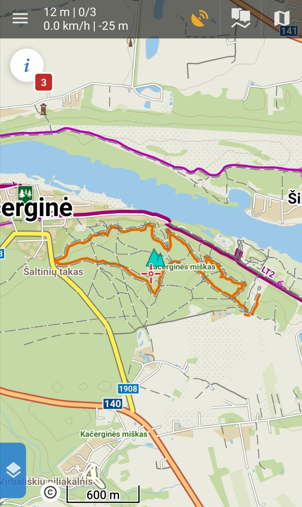
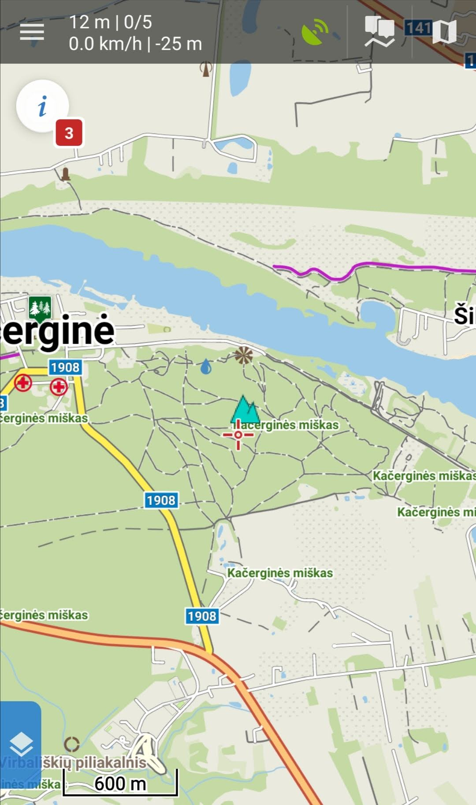
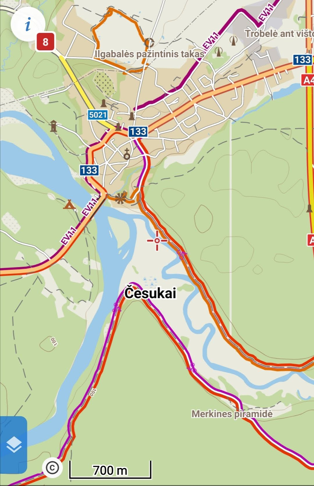
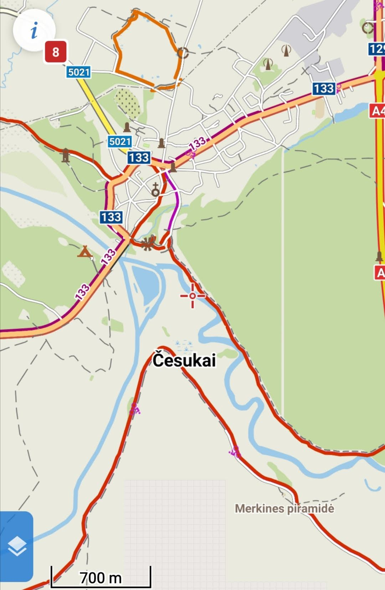

# LoMaps DIY

This is a set of simple Linux shell scripts and one additional Python3 script for updating LoMaps.

# The Rationale

I always buy and updated version of LoMaps for my little country or other countries I intend to visit for hiking&biking. However, releases are not that frequent, and OSM is updated constantly. I contribute actively to OSM myself.

This is why I started "research" on how to create an updated version of the map. The deeper I digged, the more I appreciate what Locus Map team done to deliver really nice looking and informative maps. I only partially recreated their work with the help of Petr Voldán. He was very nice and actively replied to my questions on Locus Map forum.

# Encountered Issues

It is quite easy to generate a vector map from OSM PBF files using MapsForge writer plugin for Osmosis. However, that will be only the map, whereas LoMaps highlight hiking and cycling routes with different colours and that helps one explore the country of choice. LoMaps also go together with LoPoints, a database of POIs. If you generate map yourself, you would see those POIs on it, but they will be a part of the map rendering, not interactive.

| Original Locus Maps with highlighted routes | Custom generated map |
|------------|-------------|
|  |  |

## Issue #1: Interactive POIs

LoPoints only work with LoMaps, i.e. the purchased map. If there is a purchased file `lithuania.osm.map`, accompanying POI file is `lithuania.osm.db`. If you generate those two files yourself, Locus Map app won't render your POIs.

Which leads us to this conlusion: generate map, generate/update POI database and __overwrite__ existing LoMaps files.

POI database is a `sqlite3` database file of Locus Map internal format. There is a `poi_converter` software, which can create appropriate format database or append to it.

My solution is to append POIs to original LoPoints database.

## Issue #2: Coloured Routes

MapsForge format is a very compact format and is accompanied by maps rendering themes. Theme is a XML file with additional graphics. But it has one issue: theme does not handle relations. Various hiking or other routes in the OSM are described as relations: a set of ways. But MapsForge does not handle relation inheritance on the way.

Simply put: a relation can have two attributes: `route=hiking` and `network=lwn`. It describes a hiking route of local walking network. If we set these same attributes to the way, MapsForge can colorize that way with a colour of theme's choice.

So the solution is to scan PBF file for all relations of interest, export them together with ways, apply relations attribute to the ways and generate MapsForge file.

Yikes.

This leads to second part of the problem: what if the way is a part of two relations? E.g. hiking route and cycling route?

We need to copy the way, as one way cannot contain two sets of attributes like `route=hiking` and `route=bicycle`.

For copying ways I have created my own parsing script.

# The Process

If for any reason you'd like to replicate my struggle and update outdated LoMaps file for your country (-ies), follow the steps.

You will need Python3, Java and Sqlite3. You most likely will need to execute a few `pip3 install <something>` commands for `poi_converter` to run. I don't remember those: inspect on what modules the script fails and install them.

## Backup and Copy

Backup your LoMaps files. They should be located on Android device's flash storage in `Locus/mapsVector/<continent>` directory. Files go in pairs: map+poi, e.g. `<country>.osm.map` and `<country>.osm.db`.

Also copy `<country>.osm.db` to the folder with my scripts as `locus-orig-<country>.osm.db`. It will be used as a base for adding new POIs from the latest PBF file.

## Edit Configuration

Edit the included `cfg` file. You should only be interested in changing `CONTINENT` and `COUNTRY`.

## Download Tools

The script `01-download-tools.sh` downloads the following tools required for overall process:
- Osmosis: the stream processor of OSM/PBF files
- MapsForge writer: plugin for Osmosis to create vector `*.map` files
- POI Converer: a Python3 utility, which can create/append LoPoints compatible database
- Tag Mapping descriptor from Locus Map for compatibility

Script also patches Osmosis to use up to 8 GB of PC memory. You can edit the script and force MapsForge plugin to store temporary data on the disk, but make sure you have enough space on your `tmpfs`. Maybe it's in the RAM too?

Country of Lithuania is quite small, it's PBF file is just around ~150 MB. So if Osmosis spits OutOfMemory error for your bigger country, either give more heap space (by editing osmosis/bin/osmosis file), or set MapsForge to use disk.

If all goes well, this script needs to be executed only once. Tools are left on the disk and reused later.

## Download Latest Map

The script `02-download-latest-map.sh` does exactly that: downloads the latest country's of choice map from GeoFabrik. See `cfg` for required country.

Download the country file as ofthen as you wish, but at most once per day: maps are updated after 10 PM CET, IIRC.

## Process Routes for Colouring

The script `03-process-routes.sh` runs in two steps.

First, the script extracts all relations from PBF file of types `historic|mtb|bicycle|foot|hiking`. Then it runs `parse-routes.py` script, which loads the exctracted XML file to memory and processes it. Script scans all relations and for each relation it creates new ways, but with applied attributes from the relation. Ways get specific IDs, that are currently far from maximum on OSM. One day they might be too small, however. There is a special treatment for `osmc:symbol` attribute, that Peter from Locus Map revealed to me.

For Lithuania the exctracted XML file is ~2 GB. I crafted a very stupid script, which loads the XML to memory and after processing writes it back to disk. I have a beafy machine with loads of RAM, so I don't care. But bear in mind, that script might easily consume 32 GB of RAM and swap badly. So be patient (_or add moar RAM_). Even after processed file is written to the disk the script takes significant time to perform memory release.

## Create the Map!

Run the script `04-create-map.sh`. It will merge original PBF file with processed ways file and produce a single MapsForge file. You can upload it to your phone and replace original LoMaps file.

## Update POIs

Run the script `05-append-poi.sh`. You should've copied original LoPoints file `<country>.osm.db` to the folder with scripts as `locus-orig-<country>.osm.db`. This scripts copies original file and appends with newly found POIs. Some of the POI types don't exist in original LoPoints, so it is possible you'll find lots of new ones popping around.

Owerwrite original LoPoins database on your phone with newly generated one.

# Unsolved Issues

Even though I followed the process described by Peter, I still could not get two coloured lines on one way. They are merged. It is fortunate the bicycle icon is added to underlying cycling route.

| Original Locus Maps with highlighted routes | Custom generated map |
|------------|-------------|
|  |  |

